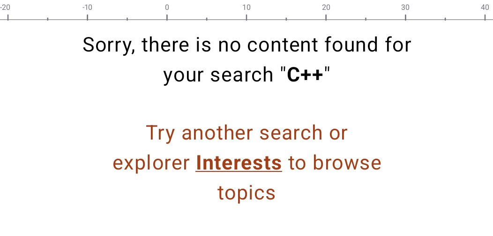

# Compose Debug Layout Toolbox

A set of tools for Compose to help you align objects: layouts, grids and rulers.

It is intended to be used only with `@Preview` Composables, in screenshot tests or in custom debug drawers.

## Installation

Release and snapshot versions of the library are published to a temporary repository, since this library is currently
used only in one pet project. File a bug report if you think it could be useful on Maven Central.

Add the following to your project's settings.gradle:

```kotlin
pluginManagement {
    repositories {
        maven {
            url = uri("https://maven.pixnews.ru")
            mavenContent {
                includeGroup("at.released.debuglayout")
            }
        }
    }
}
```

Add the dependency:

```kotlin
dependencies {
    implementation("at.released.debuglayout:core:0.1")
}
```

## Usage

Build `debuglayout {}` modifier with the set of tools you need. For example:

(these examples uses layouts from [Now in Android App](https://github.com/android/nowinandroid))

```kotlin
@Preview
@Composable
fun SimpleComposablePreview() {
    Box(
        modifier = Modifier
            .debugLayout {
                rowsFromTop(
                    rows = 1.asRowColumnCount,
                    height = 56.dp,
                    color = DebugLayoutDefaults.colorSecondary,
                )
                rowsFromBottom(
                    rows = 1.asRowColumnCount,
                    height = 56.dp,
                    color = DebugLayoutDefaults.colorTertiary,
                )
                columnsStretch(
                    columns = 4,
                    margin = 16.dp,
                    gutter = 16.dp,
                    color = DebugLayoutDefaults.colorPrimary,
                )
                verticalRuler()
            }
    ) {
        …
    }
}
```


## Tools

This library has grids, guidelines, rows columns and rules.

### Grids

`grid()` draws a simple grid of a specified size.

```kotlin
fun grid(size: Dp, color: Color, strokeWidth: Dp)
```

Example:

```kotlin
@Preview
@Composable
private fun SearchToolbarPreview() {
    Box(
        modifier = Modifier
            .debugLayout {
                grid(size = 8.dp)
            }
    ) { … }
}
```


### Guidelines

`guideline()` draws horizontal and vertical guidelines. Position of the guideline can be specified from top, bottom,
right, left, or center, with an optional offset in dp or percents.

```kotlin
fun guideline(
    position: DebugGuidelinePosition,
    color: Color,
    strokeWidth: Dp,
)
```

Example:

```kotlin
@Preview
@Composable
fun EmptySearchResultColumnPreview() {
    Box(
        modifier = Modifier
            .debugLayout {
                guideline(
                    position = Top(offset = 28.dp.asGuidelineOffset),
                    color = Color.Blue,
                )
                guideline(
                    position = Bottom(28.dp.asGuidelineOffset),
                    color = Color.Blue,
                )
                guideline(
                    position = Start(24.dp.asGuidelineOffset),
                )
                guideline(
                    position = End(16.dp.asGuidelineOffset),
                )
                guideline(
                    position = CenterHorizontal(),
                    color = Color.LightGray,
                )
                guideline(
                    position = CenterVertical(),
                    color = Color.LightGray,
                )
                guideline(
                    position = Top(offset = (2/5f).asGuidelineOffsetPercent),
                    color = Color.Yellow,
                )
            },
    ) {
        …
    }
}
```


There are also a number of auxiliary extensions:

```kotlin
DebugLayout.guidelineFromStart()
DebugLayout.guidelineFromEnd()
DebugLayout.guidelineFromTop()
DebugLayout.guidelineFromBottom()
DebugLayout.guidelineCenterHorizontal()
DebugLayout.guidelineCenterVertical()
```

### Rows and columns

Allows you to draw rows of a specified width and columns of a specified height with customized margins and gutters.

```kotlin
fun columns(
    // DebugColumnsArrangement: Top | Bottom | Center | Stretch
    arrangement: DebugColumnsArrangement,
    columns: RowsColumnsCount,
    color: Color,
)

fun rows(
    // DebugRowsArrangement: Left | Right | Center | Stretch
    arrangement: DebugRowsArrangement,
    rows: RowsColumnsCount,
    color: Color,
)
```

Example rows from top and bottom:

```kotlin
@Preview
@Composable
fun EmptySearchResultColumnPreview() {
    Box(
        modifier = Modifier
            .debugLayout {
                rows(
                    arrangement = DebugRowsArrangement.Top(
                        height = 8.dp,
                        offset = 2.dp,
                        gutter = 4.dp
                    ),
                    rows = 3.asRowColumnCount,
                    color = DebugLayoutDefaults.colorPrimary,
                )
                rows(
                    arrangement = DebugRowsArrangement.Bottom(
                        height = 8.dp,
                        offset = 2.dp,
                        gutter = 4.dp
                    ),
                    rows = 3.asRowColumnCount,
                    color = DebugLayoutDefaults.colorSecondary,
                )
                rows(
                    arrangement = DebugRowsArrangement.Center(
                        height = 12.dp,
                        gutter = 8.dp
                    ),
                    rows = 4.asRowColumnCount,
                    color = DebugLayoutDefaults.colorTertiary,
                )
            },
    ) {
        …
    }
}
```


Columns:

```kotlin
@Preview
@Composable
fun EmptySearchResultColumnPreview() {
    Box(
        modifier = Modifier
            .debugLayout {
                columns(
                    arrangement = Stretch(
                        gutter = 24.dp,
                        margin = 82.dp,
                    ),
                    columns = 3.asRowColumnCount,
                    color = DebugLayoutDefaults.colorSecondary,
                )
                columns(
                    arrangement = DebugColumnsArrangement.Right(
                        gutter = 32.dp,
                        width = 8.dp,
                        offset = 16.dp
                    ),
                    columns = Auto,
                    color = DebugLayoutDefaults.colorTertiary,
                )
            },
    ) {
        …
    }
}
```


Auxiliary extensions:

```kotlin
DebugLayout.columnsFromLeft()
DebugLayout.columnsFromRight()
DebugLayout.columnsFromCenter()
DebugLayout.columnsStretch()
DebugLayout.rowsFromTop()
DebugLayout.rowsFromBottom()
DebugLayout.rowsFromCenter()
DebugLayout.rowsStretch()
```

### Rulers

`horizontalRuler()` and `verticalRuler()` are designed to draw a horizontal or vertical ruler along the edge of
the frame.

You can set the value of the ticks on the ruler: dp, pixels, millimeters or inches and the frequency.
You can also adjust the zero position: from top, center or bottom with a defined offset.

```kotlin
fun horizontalRuler(
    step: DebugRulerMeasureUnit,
    zeroOffset: DebugRulerHorizontalZeroPoint,
)

fun verticalRuler(
    step: DebugRulerMeasureUnit = DebugLayoutDefaults.Ruler.step,
    zeroOffset: DebugRulerVerticalZeroPoint = DebugRulerVerticalZeroPoint.ZERO, 
)
```

Example of a vertical ruler with 16 dp ticks and a zero position at 16 dp from top:

```kotlin
@Preview
@Composable
fun EmptySearchResultColumnPreview() {
    Box(
        modifier = Modifier
            .debugLayout {
                verticalRuler(
                    step = 16.rulerDp,
                    zeroOffset = DebugRulerVerticalZeroPoint(
                        alignment = TOP,
                        offset = 56.rulerDp
                    ),
                )
            },
    ) { … }
}
```


Example of a horizontal ruler with a step of 10mm and a zero position at 10 mm to the left of center:

```kotlin
@Preview
@Composable
fun EmptySearchResultColumnPreview() {
    Box(
        modifier = Modifier
            .debugLayout {
                horizontalRuler(
                    step = 10.rulerMm,
                    zeroOffset = DebugRulerHorizontalZeroPoint(
                        alignment = CENTER,
                        offset = (-10).rulerMm
                    ),
                )
            },
    ) { … }
}
```



You can also check out this set of predefined layouts as example: [Material3DebugLayouts.kt](core%2fsrc%2fcommonMain%2fkotlin%2fMaterial3DebugLayouts.kt)

## Contributing

Any type of contributions are welcome. Please see the [contribution guide](CONTRIBUTING.md).

## License

These services are licensed under Apache 2.0 License. Authors and contributors are listed in the
[Authors](AUTHORS) file.

```
Copyright 2024 compose-debuglayout project authors and contributors.

Licensed under the Apache License, Version 2.0 (the "License");
you may not use this file except in compliance with the License.
You may obtain a copy of the License at

   http://www.apache.org/licenses/LICENSE-2.0

Unless required by applicable law or agreed to in writing, software
distributed under the License is distributed on an "AS IS" BASIS,
WITHOUT WARRANTIES OR CONDITIONS OF ANY KIND, either express or implied.
See the License for the specific language governing permissions and
limitations under the License.
```
